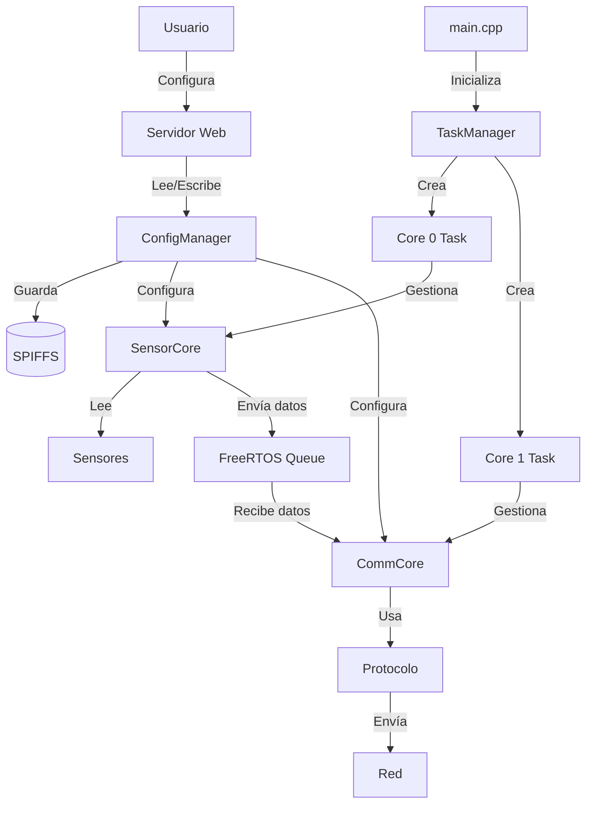

# Arquitectura del Sistema

## Diagrama de Componentes

```
┌─────────────────────────────────────────────────────────────┐
│                         ESP32                                │
│                                                               │
│  ┌────────────────────────────────────────────────────┐    │
│  │                    CORE 0                           │    │
│  │              (Sensor Management)                    │    │
│  │                                                      │    │
│  │  ┌──────────────────────────────────────────┐     │    │
│  │  │         SensorCore                        │     │    │
│  │  │  • Gestión de sensores                   │     │    │
│  │  │  • Lectura periódica                     │     │    │
│  │  │  • Validación de datos                   │     │    │
│  │  └────────────┬─────────────────────────────┘     │    │
│  │               │                                     │    │
│  │               ▼                                     │    │
│  │  ┌──────────────────────────────────────────┐     │    │
│  │  │  Sensores (BaseSensor)                   │     │    │
│  │  │  ┌────────────┬─────────────┬─────────┐ │     │    │
│  │  │  │  Digital   │   Analog    │   I2C   │ │     │    │
│  │  │  └────────────┴─────────────┴─────────┘ │     │    │
│  │  │  ┌────────────┐                         │     │    │
│  │  │  │   UART     │                         │     │    │
│  │  │  └────────────┘                         │     │    │
│  │  └──────────────────────────────────────────┘     │    │
│  └──────────────────────┬─────────────────────────────┘    │
│                         │                                   │
│                         │ FreeRTOS Queue                    │
│                         │ (Inter-Core Communication)        │
│                         │                                   │
│  ┌──────────────────────▼─────────────────────────────┐    │
│  │                    CORE 1                           │    │
│  │              (Communication)                        │    │
│  │                                                      │    │
│  │  ┌──────────────────────────────────────────┐     │    │
│  │  │         CommCore                          │     │    │
│  │  │  • Recepción de datos del Core 0        │     │    │
│  │  │  • Formateo de mensajes                  │     │    │
│  │  │  • Envío a través del protocolo          │     │    │
│  │  └────────────┬─────────────────────────────┘     │    │
│  │               │                                     │    │
│  │               ▼                                     │    │
│  │  ┌──────────────────────────────────────────┐     │    │
│  │  │  Protocolos (BaseComm)                   │     │    │
│  │  │  ┌────────────┬─────────────┬─────────┐ │     │    │
│  │  │  │   MQTT     │    TCP/IP   │   HTTP  │ │     │    │
│  │  │  └────────────┴─────────────┴─────────┘ │     │    │
│  │  └──────────────────────────────────────────┘     │    │
│  │                                                      │    │
│  │  ┌──────────────────────────────────────────┐     │    │
│  │  │       Web Server (Port 80)                │     │    │
│  │  │  • Interfaz de configuración             │     │    │
│  │  │  • API REST                              │     │    │
│  │  │  • Gestión de sensores                   │     │    │
│  │  └──────────────────────────────────────────┘     │    │
│  └──────────────────────────────────────────────────────┘    │
│                                                               │
│  ┌──────────────────────────────────────────────────────┐    │
│  │              ConfigManager                            │    │
│  │  • Carga/Guardado de configuración (SPIFFS)         │    │
│  │  • Parsing JSON                                      │    │
│  │  • Gestión de parámetros                             │    │
│  └──────────────────────────────────────────────────────┘    │
│                                                               │
│  ┌──────────────────────────────────────────────────────┐    │
│  │              TaskManager                              │    │
│  │  • Creación de tareas FreeRTOS                       │    │
│  │  • Gestión de queues                                 │    │
│  │  • Sincronización entre cores                        │    │
│  └──────────────────────────────────────────────────────┘    │
│                                                               │
└───────────────────────────────────────────────────────────────┘
```

## Flujo de Datos

```
┌────────────┐
│   Sensor   │
└─────┬──────┘
      │
      ▼
┌─────────────────┐
│  read() cada    │
│  sample_rate ms │
└─────┬───────────┘
      │
      ▼
┌──────────────────┐
│  Validar datos   │
└─────┬────────────┘
      │
      ▼
┌──────────────────────┐
│  Crear CoreMessage   │
└─────┬────────────────┘
      │
      ▼
┌───────────────────────────┐
│  Enviar a Queue          │
│  (Core 0 → Core 1)       │
└─────┬─────────────────────┘
      │
      ▼
┌──────────────────────────┐
│  Recibir en CommCore    │
│  (Core 1)                │
└─────┬────────────────────┘
      │
      ▼
┌──────────────────────────┐
│  Formatear mensaje       │
│  según protocolo         │
└─────┬────────────────────┘
      │
      ▼
┌──────────────────────────┐
│  Enviar por red          │
│  (MQTT/TCP/HTTP)         │
└──────────────────────────┘
```

## Configuración

```
┌─────────────────┐
│  Usuario        │
└────┬────────────┘
     │
     ▼
┌─────────────────────┐      ┌──────────────────┐
│  Modo Fácil:        │      │  Modo Avanzado:  │
│  Interfaz Web       │      │  Editar JSON     │
│  http://IP/         │      │  data/config.json│
└────┬────────────────┘      └────┬─────────────┘
     │                            │
     └──────────┬─────────────────┘
                │
                ▼
     ┌──────────────────────┐
     │   ConfigManager      │
     │   • Validar JSON     │
     │   • Guardar SPIFFS   │
     └──────┬───────────────┘
            │
            ▼
     ┌──────────────────────┐
     │  Aplicar config      │
     │  • Cargar sensores   │
     │  • Configurar comm   │
     │  • Reiniciar tareas  │
     └──────────────────────┘
```

## Ciclo de Vida del Sistema

```
1. Boot
   ├─ Inicializar Serial
   ├─ Inicializar SPIFFS
   └─ Mostrar banner
   
2. Cargar Configuración
   ├─ Leer config.json
   ├─ Parsear JSON
   └─ Validar parámetros
   
3. Configurar WiFi
   ├─ Modo AP o Cliente
   ├─ Conectar
   └─ Obtener IP
   
4. Iniciar Servidor Web
   ├─ Registrar rutas
   ├─ Iniciar en puerto 80
   └─ Servir interfaz
   
5. Inicializar TaskManager
   ├─ Crear queues
   ├─ Crear mutexes
   └─ Preparar tareas
   
6. Iniciar Core 0 (Sensores)
   ├─ Cargar sensores desde config
   ├─ Inicializar cada sensor
   └─ Comenzar loop de lectura
   
7. Iniciar Core 1 (Comunicación)
   ├─ Cargar protocolo desde config
   ├─ Conectar a servidor
   └─ Comenzar loop de envío
   
8. Main Loop
   ├─ Manejar requests HTTP
   ├─ Verificar conexión WiFi
   └─ Mantener sistema vivo
```

## Interacción entre Componentes



## Estructura de Archivos

```
firware/
├── src/                          # Código fuente
│   ├── main.cpp                  # Punto de entrada
│   ├── config/                   # Gestión de configuración
│   │   ├── ConfigManager.h
│   │   └── ConfigManager.cpp
│   ├── core/                     # Núcleo del sistema
│   │   ├── TaskManager.*         # Gestión de tareas dual-core
│   │   ├── SensorCore.*          # Lógica del Core 0
│   │   └── CommCore.*            # Lógica del Core 1
│   ├── sensors/                  # Módulos de sensores
│   │   ├── BaseSensor.h          # Clase base
│   │   ├── DigitalSensor.*
│   │   ├── AnalogSensor.*
│   │   ├── I2CSensor.*
│   │   └── UARTSensor.*
│   ├── communication/            # Protocolos de comunicación
│   │   ├── BaseComm.h            # Clase base
│   │   ├── MQTTComm.*
│   │   ├── TCPComm.*
│   │   └── HTTPComm.*
│   └── web/                      # Servidor web
│       ├── WebServer.h
│       └── WebServer.cpp
├── data/                         # Sistema de archivos
│   └── config.json               # Configuración del sistema
├── examples/                     # Ejemplos de configuración
│   ├── basic_config.json
│   └── advanced_config.json
├── docs/                         # Documentación
│   ├── CONFIGURATION.md
│   ├── API.md
│   ├── ADDING_SENSORS.md
│   └── ADDING_PROTOCOLS.md
└── platformio.ini                # Configuración del proyecto
```

## Patrones de Diseño Utilizados

### 1. Strategy Pattern
- `BaseSensor` y sus implementaciones
- `BaseComm` y sus implementaciones
- Permite cambiar tipos de sensores y protocolos dinámicamente

### 2. Observer Pattern (implícito)
- Sensores notifican datos a través de queues
- CommCore observa y actúa sobre los datos

### 3. Factory Pattern (simplificado)
- `SensorCore::loadSensors()` crea sensores según tipo
- `CommCore::loadCommunication()` crea protocolos según tipo

### 4. Singleton Pattern
- `ConfigManager` (instancia global)
- `TaskManager` (instancia global)

## Consideraciones de Rendimiento

### Core 0 (Sensores)
- Prioridad: Media
- Frecuencia: Depende del sample_rate de cada sensor
- Stack: 8KB
- Operaciones: Lectura de sensores, escritura a queue

### Core 1 (Comunicación)
- Prioridad: Media
- Frecuencia: Lectura continua de queue + loop del protocolo
- Stack: 8KB
- Operaciones: Lectura de queue, formateo, envío por red

### Main Loop
- Core: Core 1 (por defecto de Arduino)
- Operaciones: Manejo del servidor web, verificación WiFi
- Debe mantenerse no-bloqueante

## Seguridad

- Contraseñas en configuración (considera encriptación)
- TLS/SSL para comunicaciones (cuando sea posible)
- Autenticación en servidor web (por implementar)
- Sanitización de inputs en API REST

## Escalabilidad

- Agregar sensores: Crear clase heredando de `BaseSensor`
- Agregar protocolos: Crear clase heredando de `BaseComm`
- Agregar endpoints: Registrar en `WebServer::begin()`
- Múltiples dispositivos: Cambiar `device_name` y `client_id`
