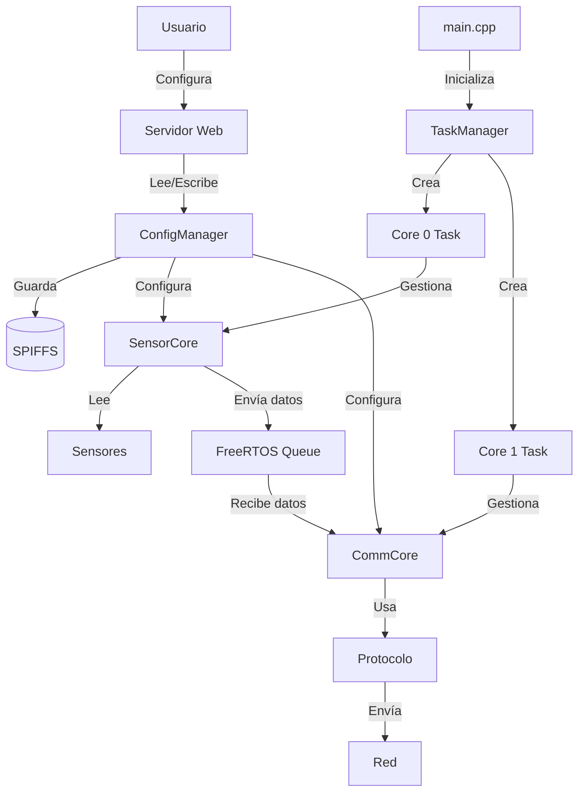

# Arquitectura del Sistema

## Diagrama de Componentes

```
┌─────────────────────────────────────────────────────────────┐
│                         ESP32                                │
│                                                               │
│  ┌────────────────────────────────────────────────────┐    │
│  │                    CORE 0                           │    │
│  │              (Sensor Management)                    │    │
│  │                                                      │    │
│  │  ┌──────────────────────────────────────────┐     │    │
│  │  │         SensorCore                        │     │    │
│  │  │  • Gestión de sensores                   │     │    │
│  │  │  • Lectura periódica                     │     │    │
│  │  │  • Validación de datos                   │     │    │
│  │  └────────────┬─────────────────────────────┘     │    │
│  │               │                                     │    │
│  │               ▼                                     │    │
│  │  ┌──────────────────────────────────────────┐     │    │
│  │  │  Sensores (BaseSensor)                   │     │    │
│  │  │  ┌────────────┬─────────────┬─────────┐ │     │    │
│  │  │  │  Digital   │   Analog    │   I2C   │ │     │    │
│  │  │  └────────────┴─────────────┴─────────┘ │     │    │
│  │  │  ┌────────────┐                         │     │    │
│  │  │  │   UART     │                         │     │    │
│  │  │  └────────────┘                         │     │    │
│  │  └──────────────────────────────────────────┘     │    │
│  └──────────────────────┬─────────────────────────────┘    │
│                         │                                   │
│                         │ FreeRTOS Queue                    │
│                         │ (Inter-Core Communication)        │
│                         │                                   │
│  ┌──────────────────────▼─────────────────────────────┐    │
│  │                    CORE 1                           │    │
│  │              (Communication)                        │    │
│  │                                                      │    │
│  │  ┌──────────────────────────────────────────┐     │    │
│  │  │         CommCore                          │     │    │
│  │  │  • Recepción de datos del Core 0        │     │    │
│  │  │  • Formateo de mensajes                  │     │    │
│  │  │  • Envío a través del protocolo          │     │    │
│  │  └────────────┬─────────────────────────────┘     │    │
│  │               │                                     │    │
│  │               ▼                                     │    │
│  │  ┌──────────────────────────────────────────┐     │    │
│  │  │  Protocolos (BaseComm)                   │     │    │
│  │  │  ┌────────────┬─────────────┬─────────┐ │     │    │
│  │  │  │   MQTT     │    TCP/IP   │   HTTP  │ │     │    │
│  │  │  └────────────┴─────────────┴─────────┘ │     │    │
│  │  └──────────────────────────────────────────┘     │    │
│  │                                                      │    │
│  │  ┌──────────────────────────────────────────┐     │    │
│  │  │       Web Server (Port 80)                │     │    │
│  │  │  • Interfaz de configuración             │     │    │
│  │  │  • API REST                              │     │    │
│  │  │  • Gestión de sensores                   │     │    │
│  │  └──────────────────────────────────────────┘     │    │
│  └──────────────────────────────────────────────────────┘    │
│                                                               │
│  ┌──────────────────────────────────────────────────────┐    │
│  │              ConfigManager                            │    │
│  │  • Carga/Guardado de configuración (SPIFFS)         │    │
│  │  • Parsing JSON                                      │    │
│  │  • Gestión de parámetros                             │    │
│  └──────────────────────────────────────────────────────┘    │
│                                                               │
│  ┌──────────────────────────────────────────────────────┐    │
│  │              TaskManager                              │    │
│  │  • Creación de tareas FreeRTOS                       │    │
│  │  • Gestión de queues                                 │    │
│  │  • Sincronización entre cores                        │    │
│  └──────────────────────────────────────────────────────┘    │
│                                                               │
└───────────────────────────────────────────────────────────────┘
```

## Flujo de Datos

```
┌────────────┐
│   Sensor   │
└─────┬──────┘
      │
      ▼
┌─────────────────┐
│  read() cada    │
│  sample_rate ms │
└─────┬───────────┘
      │
      ▼
┌──────────────────┐
│  Validar datos   │
└─────┬────────────┘
      │
      ▼
┌──────────────────────┐
│  Crear CoreMessage   │
└─────┬────────────────┘
      │
      ▼
┌───────────────────────────┐
│  Enviar a Queue          │
│  (Core 0 → Core 1)       │
└─────┬─────────────────────┘
      │
      ▼
┌──────────────────────────┐
│  Recibir en CommCore    │
│  (Core 1)                │
└─────┬────────────────────┘
      │
      ▼
┌──────────────────────────┐
│  Formatear mensaje       │
│  según protocolo         │
└─────┬────────────────────┘
      │
      ▼
┌──────────────────────────┐
│  Enviar por red          │
│  (MQTT/TCP/HTTP)         │
└──────────────────────────┘
```

## Configuración

```
┌─────────────────┐
│  Usuario        │
└────┬────────────┘
     │
     ▼
┌─────────────────────┐      ┌──────────────────┐
│  Modo Fácil:        │      │  Modo Avanzado:  │
│  Interfaz Web       │      │  Editar JSON     │
│  http://IP/         │      │  data/config.json│
└────┬────────────────┘      └────┬─────────────┘
     │                            │
     └──────────┬─────────────────┘
                │
                ▼
     ┌──────────────────────┐
     │   ConfigManager      │
     │   • Validar JSON     │
     │   • Guardar SPIFFS   │
     └──────┬───────────────┘
            │
            ▼
     ┌──────────────────────┐
     │  Aplicar config      │
     │  • Cargar sensores   │
     │  • Configurar comm   │
     │  • Reiniciar tareas  │
     └──────────────────────┘
```

## Ciclo de Vida del Sistema

```
1. Boot
   ├─ Inicializar Serial
   ├─ Inicializar SPIFFS
   └─ Mostrar banner
   
2. Cargar Configuración
   ├─ Leer config.json
   ├─ Parsear JSON
   └─ Validar parámetros
   
3. Configurar WiFi
   ├─ Modo AP o Cliente
   ├─ Conectar
   └─ Obtener IP
   
4. Iniciar Servidor Web
   ├─ Registrar rutas
   ├─ Iniciar en puerto 80
   └─ Servir interfaz
   
5. Inicializar TaskManager
   ├─ Crear queues
   ├─ Crear mutexes
   └─ Preparar tareas
   
6. Iniciar Core 0 (Sensores)
   ├─ Cargar sensores desde config
   ├─ Inicializar cada sensor
   └─ Comenzar loop de lectura
   
7. Iniciar Core 1 (Comunicación)
   ├─ Cargar protocolo desde config
   ├─ Conectar a servidor
   └─ Comenzar loop de envío
   
8. Main Loop
   ├─ Manejar requests HTTP
   ├─ Verificar conexión WiFi
   └─ Mantener sistema vivo
```

## Interacción entre Componentes



## Estructura de Archivos

```
firware/
├── src/                          # Código fuente
│   ├── main.cpp                  # Punto de entrada
│   ├── config/                   # Gestión de configuración
│   │   ├── ConfigManager.h
│   │   └── ConfigManager.cpp
│   ├── core/                     # Núcleo del sistema
│   │   ├── TaskManager.*         # Gestión de tareas dual-core
│   │   ├── SensorCore.*          # Lógica del Core 0
│   │   └── CommCore.*            # Lógica del Core 1
│   ├── sensors/                  # Módulos de sensores
│   │   ├── BaseSensor.h          # Clase base
│   │   ├── DigitalSensor.*
│   │   ├── AnalogSensor.*
│   │   ├── I2CSensor.*
│   │   └── UARTSensor.*
│   ├── communication/            # Protocolos de comunicación
│   │   ├── BaseComm.h            # Clase base
│   │   ├── MQTTComm.*
│   │   ├── TCPComm.*
│   │   └── HTTPComm.*
│   └── web/                      # Servidor web
│       ├── WebServer.h
│       └── WebServer.cpp
├── data/                         # Sistema de archivos
│   └── config.json               # Configuración del sistema
├── examples/                     # Ejemplos de configuración
│   ├── basic_config.json
│   └── advanced_config.json
├── docs/                         # Documentación
│   ├── CONFIGURATION.md
│   ├── API.md
│   ├── ADDING_SENSORS.md
│   └── ADDING_PROTOCOLS.md
└── platformio.ini                # Configuración del proyecto
```

## Patrones de Diseño Utilizados

### 1. Strategy Pattern
- `BaseSensor` y sus implementaciones
- `BaseComm` y sus implementaciones
- Permite cambiar tipos de sensores y protocolos dinámicamente

### 2. Observer Pattern (implícito)
- Sensores notifican datos a través de queues
- CommCore observa y actúa sobre los datos

### 3. Factory Pattern (simplificado)
- `SensorCore::loadSensors()` crea sensores según tipo
- `CommCore::loadCommunication()` crea protocolos según tipo

### 4. Singleton Pattern
- `ConfigManager` (instancia global)
- `TaskManager` (instancia global)

## Consideraciones de Rendimiento

### Core 0 (Sensores)
- Prioridad: Media
- Frecuencia: Depende del sample_rate de cada sensor
- Stack: 8KB
- Operaciones: Lectura de sensores, escritura a queue

### Core 1 (Comunicación)
- Prioridad: Media
- Frecuencia: Lectura continua de queue + loop del protocolo
- Stack: 8KB
- Operaciones: Lectura de queue, formateo, envío por red

### Main Loop
- Core: Core 1 (por defecto de Arduino)
- Operaciones: Manejo del servidor web, verificación WiFi
- Debe mantenerse no-bloqueante

## Seguridad

- Contraseñas en configuración (considera encriptación)
- TLS/SSL para comunicaciones (cuando sea posible)
- Autenticación en servidor web (por implementar)
- Sanitización de inputs en API REST

## Escalabilidad

- Agregar sensores: Crear clase heredando de `BaseSensor`
- Agregar protocolos: Crear clase heredando de `BaseComm`
- Agregar endpoints: Registrar en `WebServer::begin()`
- Múltiples dispositivos: Cambiar `device_name` y `client_id`

---

# Opfine Platform — Roadmap Completo

## Visión General

El objetivo a largo plazo es convertir este firmware en **Opfine Platform**: una plataforma de automatización visual embebida, donde el ESP32 actúa como servidor autónomo con editor de flujos, constructor de HMI y supervisión SCADA, todo accesible desde el navegador sin instalar nada.

```
┌─────────────────────────────────────────────────────────────────┐
│                      OPFINE PLATFORM                            │
├─────────────────┬──────────────────┬────────────────────────────┤
│   Flow Editor   │   HMI Builder    │     SCADA Dashboard        │
│   (lógica)      │   (pantallas)    │     (supervisión)          │
├─────────────────┴──────────────────┴────────────────────────────┤
│                  WebSocket / REST API                           │
├─────────────────────────────────────────────────────────────────┤
│   ESP32 #1       │   ESP32 #2       │   ESP32 #N               │
│   Flow Engine    │   Flow Engine    │   Flow Engine             │
│   (actual base)  │                  │                           │
└─────────────────────────────────────────────────────────────────┘
```

---

## FASE 1 — Motor de Flujos en ESP32 (Flow Engine)
> Base de todo el sistema. Sin esto no hay nada.

### Qué es
Un ejecutor de grafos dirigidos (DAG) que corre en FreeRTOS. El usuario define un flujo en JSON, el ESP32 lo interpreta y ejecuta en tiempo real.

### Formato del flujo (JSON)
```json
{
  "flow": [
    { "id": "n1", "type": "analog_input", "pin": 34, "interval_ms": 1000 },
    { "id": "n2", "type": "threshold",    "op": ">", "value": 2048 },
    { "id": "n3", "type": "gpio_output",  "pin": 26, "on_value": 1 },
    { "id": "n4", "type": "mqtt_publish", "topic": "alerta/calor" }
  ],
  "wires": [
    { "from": "n1", "to": "n2" },
    { "from": "n2", "to": "n3" },
    { "from": "n2", "to": "n4" }
  ]
}
```

### Nodos iniciales a implementar

**Entradas**
| Nodo | Descripción |
|---|---|
| `analog_input` | Lee ADC en un pin |
| `digital_input` | Lee GPIO digital |
| `i2c_sensor` | Lee sensor I2C genérico |
| `uart_input` | Lee datos UART |
| `timer` | Genera pulso cada N ms |
| `mqtt_subscribe` | Recibe mensaje MQTT |
| `http_input` | Recibe POST HTTP |

**Lógica**
| Nodo | Descripción |
|---|---|
| `threshold` | Compara valor con umbral |
| `switch` | Enruta según valor |
| `map` | Escala un rango a otro |
| `debounce` | Filtra cambios rápidos |
| `average` | Promedio de N muestras |
| `delay` | Retrasa la señal N ms |

**Salidas**
| Nodo | Descripción |
|---|---|
| `gpio_output` | Activa/desactiva pin GPIO |
| `pwm_output` | Salida PWM con duty cycle |
| `mqtt_publish` | Publica en MQTT |
| `http_post` | Envía POST HTTP |
| `serial_log` | Imprime en consola serial |

### Archivos a crear
```
src/
├── flow/
│   ├── FlowEngine.h / .cpp      ← Ejecutor principal del grafo
│   ├── FlowNode.h               ← Clase base de nodo
│   ├── FlowWire.h               ← Conexión entre nodos
│   ├── NodeRegistry.h / .cpp   ← Registro dinámico de tipos de nodo
│   └── nodes/
│       ├── InputNodes.h / .cpp
│       ├── LogicNodes.h / .cpp
│       └── OutputNodes.h / .cpp
```

### API REST nueva
```
GET  /api/flow          → Retorna el flujo actual
POST /api/flow          → Guarda y aplica nuevo flujo
GET  /api/flow/status   → Estado en tiempo real de cada nodo
DEL  /api/flow          → Limpia el flujo
```

### Integración con la arquitectura actual
- `FlowEngine` reemplaza a `SensorCore` + `CommCore` como lógica de ejecución
- `ConfigManager` pasa a gestionar también `flow.json` en SPIFFS
- `TaskManager` crea la tarea del motor de flujos en Core 0

---

## FASE 2 — Editor Visual Web (Flow Editor)
> El usuario arrastra y conecta nodos desde el navegador.

### Qué es
Una SPA (Single Page Application) servida directamente desde el ESP32 por SPIFFS o desde CDN. Usa una librería de canvas para nodos interactivos.

### Stack tecnológico
- **React** + **React Flow** (canvas de nodos)
- Compilado como bundle estático → sube a SPIFFS
- Comunicación con el ESP32 por REST + WebSocket

### Interfaz
```
┌─────────────────────────────────────────────────────┐
│  [Guardar] [Ejecutar] [Detener]   Opfine Flow       │
├────────────┬────────────────────────────────────────┤
│  PALETA    │                                        │
│            │     ┌──────────┐                      │
│  Entradas  │     │Analog In │──→ ┌──────────┐      │
│  • Analog  │     │ Pin 34   │    │Threshold │──→   │
│  • Digital │     └──────────┘    │  > 2048  │      │
│  • Timer   │                     └──────────┘      │
│  • MQTT    │                                        │
│            │                                        │
│  Lógica    │                                        │
│  • If      │                                        │
│  • Switch  │                                        │
│  • Map     │                                        │
│            │                                        │
│  Salidas   │                                        │
│  • GPIO    │                                        │
│  • MQTT    │                                        │
│  • HTTP    │                                        │
└────────────┴────────────────────────────────────────┘
```

### WebSocket — datos en tiempo real
```json
// ESP32 → Navegador (cada 500ms)
{
  "node_id": "n1",
  "value": 1847,
  "timestamp": 1709731200
}
```

### Archivos a crear
```
web/
├── src/
│   ├── App.jsx
│   ├── components/
│   │   ├── FlowCanvas.jsx       ← Canvas principal (React Flow)
│   │   ├── NodePalette.jsx      ← Panel izquierdo con tipos de nodo
│   │   ├── NodeConfig.jsx       ← Panel de propiedades del nodo seleccionado
│   │   └── Toolbar.jsx
│   └── nodes/
│       ├── AnalogInputNode.jsx
│       ├── ThresholdNode.jsx
│       └── ...
├── package.json
└── vite.config.js
```

---

## FASE 3 — HMI Builder (Constructor de Pantallas)
> El operador diseña su panel de control visual.

### Qué es
Un constructor de interfaces drag & drop donde el usuario coloca widgets (gauges, botones, gráficas) y los vincula a nodos del flujo. El resultado es una pantalla interactiva en tiempo real.

### Widgets disponibles
| Widget | Descripción |
|---|---|
| `gauge` | Velocímetro circular con valor actual |
| `bar` | Barra de progreso |
| `chart` | Gráfica de tendencia histórica |
| `label` | Texto con valor de nodo |
| `led` | Indicador booleano (ON/OFF) |
| `button` | Botón que activa un nodo |
| `toggle` | Interruptor booleano |
| `slider` | Control numérico |
| `alarm` | Banner de alerta con umbral |

### Ejemplo de HMI en operación
```
┌────────────────────────────────────────────────┐
│         PANEL DE CONTROL — LÍNEA 1             │
├────────────┬───────────────┬───────────────────┤
│            │               │                   │
│  🌡 42.3°C │  💧 2.4 bar   │  ⚡ 220V         │
│  [gauge]   │  [gauge]      │  [gauge]          │
│            │               │   ⚠️ ALERTA       │
├────────────┴───────────────┴───────────────────┤
│  Temperatura (últimas 2h)                      │
│  [chart ──────────/\──────── ]                 │
├────────────────────────────────────────────────┤
│  [▶ INICIAR]   [⏹ PARAR]   [🔄 RESET]         │
└────────────────────────────────────────────────┘
```

### Formato de pantalla HMI (JSON en SPIFFS)
```json
{
  "hmi": {
    "title": "Panel Línea 1",
    "widgets": [
      {
        "id": "w1",
        "type": "gauge",
        "label": "Temperatura",
        "node_id": "n1",
        "min": 0, "max": 100,
        "unit": "°C",
        "alert_above": 80,
        "position": { "x": 10, "y": 10 }
      },
      {
        "id": "w2",
        "type": "button",
        "label": "Iniciar Motor",
        "target_node": "n3",
        "on_value": 1,
        "position": { "x": 10, "y": 200 }
      }
    ]
  }
}
```

---

## FASE 4 — SCADA Dashboard (Supervisión Multi-dispositivo)
> Un solo panel que supervisa todos los ESP32 de la planta.

### Qué es
Una aplicación web centralizada (puede correr en PC o servidor ligero) que agrega datos de múltiples ESP32, muestra su estado, permite enviar comandos, y guarda histórico de alarmas.

### Arquitectura SCADA
```
┌─────────────────────────────────────────────┐
│         SCADA Dashboard (PC / servidor)     │
│                                             │
│  ┌──────────┐  ┌──────────┐  ┌──────────┐ │
│  │ Máquina1 │  │ Máquina2 │  │ Máquina3 │ │
│  │ ESP32 #1 │  │ ESP32 #2 │  │ ESP32 #3 │ │
│  │ ✅ Online │  │ ✅ Online │  │ ⚠️ Alerta│ │
│  │ T: 38°C  │  │ T: 25°C  │  │ T: 91°C  │ │
│  └──────────┘  └──────────┘  └──────────┘ │
│                                             │
│  [Histórico de alarmas]  [Exportar CSV]     │
└─────────────────────────────────────────────┘
         │                │               │
    WebSocket         WebSocket       WebSocket
         │                │               │
    [ESP32 #1]       [ESP32 #2]      [ESP32 #3]
```

### Funcionalidades SCADA
- **Mapa de dispositivos** — vista de planta con ESP32 posicionados
- **Estado en tiempo real** — online/offline, última lectura, alertas activas
- **Historial de alarmas** — log con timestamp, dispositivo, tipo de evento
- **Tendencias** — gráficas comparativas entre dispositivos
- **Comandos remotos** — enviar valores a nodos de cualquier ESP32
- **OTA Update** — actualizar firmware de todos los ESP32 desde el panel
- **Roles de usuario** — Operador, Supervisor, Administrador

---

## FASE 5 — Ecosistema y Comunidad

### Marketplace de nodos
Repositorio online donde la comunidad puede publicar nodos personalizados:
- Nodo para sensor DHT22
- Nodo para pantalla OLED
- Nodo para Telegram
- Nodo para Google Sheets
- Nodo para bases de datos (InfluxDB, Firebase)

### OTA desde el editor
```
FlowEditor → [Actualizar firmware] → descarga .bin de GitHub → 
→ envía a ESP32 por HTTP PUT /api/ota → ESP32 se reinicia con nuevo firmware
```

### App móvil
- Visualización del HMI desde smartphone
- Notificaciones push de alarmas
- Control básico de dispositivos

---

## Resumen de Fases y Prioridades

| Fase | Nombre | Prioridad | Estado |
|------|--------|-----------|--------|
| 0 | Firmware base modular (actual) | ✅ Completada | Listo |
| 1 | Flow Engine en ESP32 (C++) | 🔴 Alta | Pendiente |
| 2 | Editor visual web (React) | 🔴 Alta | Pendiente |
| 3 | HMI Builder | 🟡 Media | Pendiente |
| 4 | SCADA Dashboard | 🟡 Media | Pendiente |
| 5 | Ecosistema / App móvil | 🟢 Baja | Futuro |

## Próximos pasos inmediatos (Fase 1)

1. Definir la clase base `FlowNode` con interfaz `execute(value) → value`
2. Implementar `NodeRegistry` con registro dinámico por string
3. Implementar `FlowEngine` que parsea el JSON y construye el grafo
4. Implementar el executor DAG con FreeRTOS (tarea en Core 0)
5. Agregar endpoints REST `/api/flow` en `WebServer`
6. Implementar WebSocket server para datos en tiempo real
7. Crear 5 nodos básicos: `analog_input`, `threshold`, `gpio_output`, `mqtt_publish`, `serial_log`
8. Prueba end-to-end: sensor → condición → actuador

